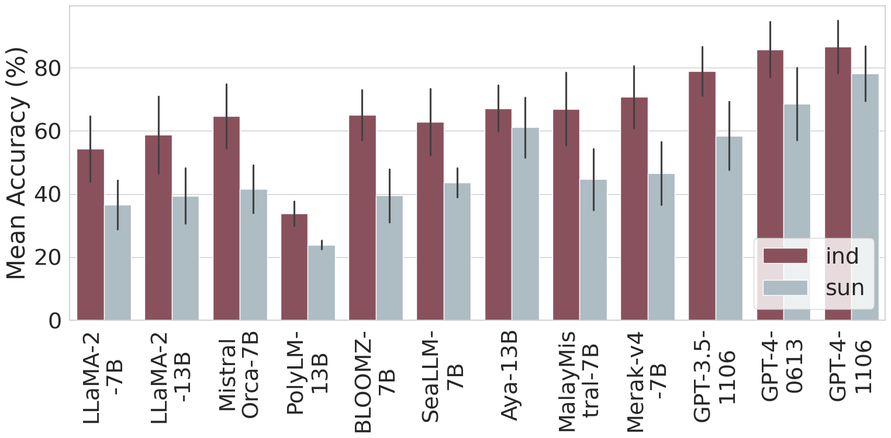

# Indonesian & Sundanese CommonsenseQA

Dataset and code for paper: ["Can LLM Generate Culturally Relevant Commonsense QA Data? Case Study in Indonesian and Sundanese"](https://arxiv.org/abs/2402.17302).

Our dataset can also be accessed at 🤗 [HuggingFace Hub](https://huggingface.co/collections/rifkiaputri/indonesian-and-sundanese-commonsenseqa-666abfe6e9fa3d54052c99b8).

In this work, we investigate the effectiveness of using LLMs in generating culturally relevant CommonsenseQA datasets for Indonesian and Sundanese languages. To do so, we create datasets using various methods: (1) _Automatic Data Adaptation_, (2) _Manual Data Generation_, and (3) _Automatic Data Generation_. The illustration of each dataset generation method is shown in the figure below.


Please refer to the paper for more details.

## Dataset Description
Based on the dataset generation methods, we have three data variation:

1. `LLM_Adapt`: LLM-generated* dataset constructed through automatic data adaptation method.
2. `Human_Gen`: human-generated dataset constructed through manual data generation method.
3. `LLM_Gen`: LLM-generated* dataset constructed through automatic data generation method.

_*\) Note: We utilized GPT-4 Turbo (11-06 ver.) as the LLM._

All datasets are provided in the `dataset` directory. Generally, each data item consists of a multiple-choice question with five options and one correct answer.

For `Human_Gen` dataset specifically, we provide one answer (`answer_majority`), which is based on the majority voting from: one answer from the question creator (`answer_creator`), and answers from other annotators (`answers`). We also provide more metadata related to the answers, such as `answers_uncertainty`, `questions_ambiguity`, `option_ambiguity` and `reason` (a freetext explanation for why the annotators marked the question or option as ambiguous).

## Dataset Generation
The code for generating the LLM-generated datasets are available in the `generation` folder. Please refer to this [README](generation/README.md) for details.

## LLM Evaluation on our Dataset
In the paper, we evaluated several LLMs, including English-centric, multilingual, and monolingual LLMs. The graph below shows their overall performance on our combined dataset.



We also provide the code to run this evaluation. Please refer to this [README](evaluation/README.md) for details.

## License
Our datasets are available under the Creative Commons Non-Commercial (CC BY-NC 4.0).

## Citation
Please cite this paper if you use any dataset or code in this repository:
```
@inproceedings{putri-etal-2024-llm,
    title = "Can {LLM} Generate Culturally Relevant Commonsense {QA} Data? Case Study in {I}ndonesian and {S}undanese",
    author = "Putri, Rifki Afina  and
      Haznitrama, Faiz Ghifari  and
      Adhista, Dea  and
      Oh, Alice",
    editor = "Al-Onaizan, Yaser  and
      Bansal, Mohit  and
      Chen, Yun-Nung",
    booktitle = "Proceedings of the 2024 Conference on Empirical Methods in Natural Language Processing",
    month = nov,
    year = "2024",
    address = "Miami, Florida, USA",
    publisher = "Association for Computational Linguistics",
    url = "https://aclanthology.org/2024.emnlp-main.1145",
    pages = "20571--20590",
}
```
